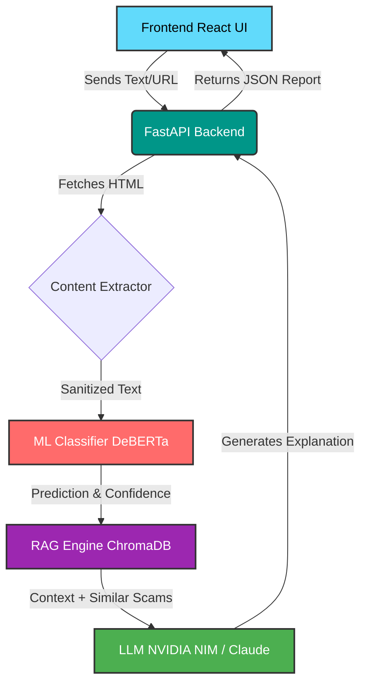

<div align="center">
  
# 🛡️ ScamMirror AI
  
**Empowering users with Explainable AI to reflect and reveal online threats.**

[](https://www.python.org/)
[](https://fastapi.tiangolo.com/)
[](https://reactjs.org/)
[](https://tailwindcss.com/)
[](#)
[](#)
[](https://opensource.org/licenses/MIT)

ScamMirror AI is an intelligent platform that analyzes URLs, emails, messages, and website content to identify phishing, fraud, and online scams. Instead of just giving binary predictions, it uses Explainable AI to tell you exactly *why* something is a threat.

---

</div>

## 📑 Table of Contents
- [Demo](#-demo)
- [Problem Statement](#-problem-statement)
- [Solution](#-solution)
- [Features](#-features)
- [Architecture](#-architecture)
- [Tech Stack](#-tech-stack)
- [AI Pipeline](#-ai-pipeline)
- [Project Structure](#-project-structure)
- [Example Workflow](#-example-workflow)
- [Installation](#-installation)
- [Environment Variables](#-environment-variables)
- [API Endpoints](#-api-endpoints)
- [Screenshots](#-screenshots)
- [Future Improvements](#-future-improvements)
- [Why This Project Matters](#-why-this-project-matters)
- [Team](#-team)
- [License](#-license)
- [Acknowledgements](#-acknowledgements)

---

## 🎥 Demo

> [!NOTE]  
> **Live Demo**: [scammirror.ai (Placeholder)](#)  
> **Demo Video**: [Watch on YouTube (Placeholder)](#)  
> **Presentation**: [View Slides (Placeholder)](#)


---

## 🛑 Problem Statement

The internet has become a minefield. With the rise of generative AI, **online scams are increasing in sophistication and volume**. Phishing emails look flawless, fake websites are pixel-perfect, and fraudulent job offers appear entirely legitimate.

Traditional security tools and existing scam detectors are insufficient because:
- **Binary Predictions Fail Users**: Simply telling someone a link is "unsafe" doesn't educate them. 
- **Lack of Transparency**: Users don't trust black-box models. 
- **Evolving Threats**: Static blocklists cannot keep up with dynamically generated phishing sites.

**Explainability matters.** AI should not just block threats; it should *assist and educate* users by explaining the red flags, helping them develop better digital intuition.

---

## 💡 Solution

**ScamMirror AI** acts as a mirror that reflects the true nature of any digital content. 

In simple terms, you paste a suspicious message or a shady link into ScamMirror, and it:
- **✔ Detects scams** using a hybrid machine learning pipeline.
- **✔ Explains reasoning** in plain English.
- **✔ Uses Retrieval-Augmented Generation (RAG)** to find similar known scams.
- **✔ Uses LLM explanations** to highlight specific manipulative tactics.
- **✔ Works on URLs and text** by extracting web content dynamically.
- **✔ Provides a confidence score** to quantify the risk level.

---

## ✨ Features

- ✅ **Scam Classification**: High-accuracy detection of phishing, financial fraud, and fake offers.
- ✅ **Explainable AI**: Plain-text breakdown of why the content was flagged.
- ✅ **URL Analysis**: Automated headless extraction of website text and metadata.
- ✅ **AI-generated Risk Report**: Shareable, detailed threat assessments.
- ✅ **Retrieval-Augmented Knowledge**: Cross-references against a dynamic database of known scams.
- ✅ **Modern Dashboard**: A gorgeous, glassmorphism-inspired React interface.
- ✅ **Responsive UI**: Flawless experience on desktop, tablet, and mobile.
- ✅ **FastAPI Backend**: Asynchronous, high-performance Python backend.
- ✅ **REST APIs**: Developer-friendly endpoints for seamless integration.

---

## 🏗️ Architecture



---

## 🛠️ Tech Stack

| Layer | Technologies |
| :--- | :--- |
| **Frontend** | React 18, Vite, Tailwind CSS, Framer Motion, Axios |
| **Backend** | Python 3.9+, FastAPI, Uvicorn, Gunicorn |
| **Machine Learning** | PyTorch, Transformers (HuggingFace), Scikit-Learn |
| **Database** | SQLite (SQLAlchemy ORM), Alembic |
| **RAG / Vector Store** | ChromaDB, Sentence Transformers |
| **LLM Inference** | NVIDIA NIM API / Anthropic Claude API |
| **Data Extraction** | HTTPX, BeautifulSoup4 |

---

## 🧠 AI Pipeline

The core intelligence of ScamMirror AI relies on a multi-stage pipeline:

1. **📥 Input**: User submits a raw message or a suspicious URL.
2. **🕸️ Content Extraction**: If a URL is provided, the backend asynchronously scrapes the visible text and analyzes domain heuristics (e.g., suspicious TLDs).
3. **🤖 ML Classification**: A lightweight, fine-tuned transformer model categorizes the threat and assigns a confidence score.
4. **🔍 Similarity Search**: The input is vectorized and queried against a vector database of known threat signatures.
5. **📚 Context Retrieval**: Relevant past scams and community intelligence are retrieved.
6. **💬 LLM Explanation**: An LLM consumes the classification, the extracted content, and the RAG context to draft a personalized, human-readable warning.
7. **📊 Risk Report**: The aggregated data is structured into a detailed JSON response for the frontend.

---

## 📂 Project Structure

```text
scammirror-ai/
├── backend/
│   ├── app/
│   │   ├── core/          # Configuration and DB setup
│   │   ├── models/        # SQLAlchemy database models
│   │   ├── routers/       # API endpoints (v1)
│   │   ├── schemas/       # Pydantic validation models
│   │   ├── services/      # ML, RAG, and core business logic
│   │   └── utils/         # Helpers and logging
│   ├── chroma_db/         # Persistent vector store
│   ├── data/              # Datasets and processing scripts
│   ├── scripts/           # Training and evaluation utilities
│   ├── requirements.txt   # Python dependencies
│   └── .env               # Backend secrets
├── frontend/
│   ├── public/            # Static assets
│   ├── src/
│   │   ├── components/    # React UI components
│   │   ├── context/       # Global state management
│   │   ├── hooks/         # Custom API hooks
│   │   ├── services/      # Axios API configuration
│   │   └── App.jsx        # Root application
│   ├── package.json       # Node dependencies
│   ├── tailwind.config.js # Styling configuration
│   └── vite.config.js     # Build tool config
└── README.md              # Project documentation
```

---

## 🔄 Example Workflow

1. **User enters URL**: `https://bit.ly/secure-banking-update-xyz`
2. **Backend extracts content**: Scrapes the hidden HTML behind the shortlink.
3. **ML predicts**: Flags as `Likely Scam` (Confidence: 98.5%).
4. **Retriever finds similar scams**: Matches with a known "Urgent Account Suspension" phishing campaign in ChromaDB.
5. **LLM generates explanation**: *"This link masks its true destination. The webpage creates artificial urgency demanding your credentials, a common tactic used in banking phishing scams."*
6. **Frontend displays report**: The user sees a red alert dashboard with clear recommended actions.

---

## 🚀 Installation

### Prerequisites
- **Python 3.9+**
- **Node.js 18+**
- **Git**

### 1. Clone the Repository
```bash
git clone https://github.com/yourusername/scammirror-ai.git
cd scammirror-ai
```

### 2. Backend Setup
```bash
cd backend
python -m venv .venv
source .venv/bin/activate  # On Windows use: .venv\Scripts\activate
pip install -r requirements.txt
```

### 3. Frontend Setup
```bash
cd ../frontend
npm install
```

### 4. Environment Variables
See the [Environment Variables](#-environment-variables) section below to set up your `.env` files.

### 5. Run the Application
**Start the Backend (Terminal 1):**
```bash
cd backend
uvicorn app.main:app --reload
```
*API runs on http://localhost:8000*

**Start the Frontend (Terminal 2):**
```bash
cd frontend
npm run dev
```
*App runs on http://localhost:5173*

---

## 🔐 Environment Variables

### Backend (`backend/.env`)

| Variable | Description | Required |
| :--- | :--- | :---: |
| `DATABASE_URL` | SQLAlchemy connection string (default: SQLite) | No |
| `NIM_API_KEY` | API Key for NVIDIA NIM LLM endpoints | Yes* |
| `NIM_API_URL` | API Endpoint URL for the chosen LLM | No |
| `NIM_MODEL` | Specific LLM model to use (e.g., nemotron-3-8b-chat) | No |
| `CORS_ORIGINS` | Comma-separated list of allowed frontend URLs | No |

*\* If omitted, the system falls back to a rule-based mock response.*

### Frontend (`frontend/.env`)

| Variable | Description | Required |
| :--- | :--- | :---: |
| `VITE_API_URL` | Base URL for the backend API in production | Yes (Prod) |

---

## 🌐 API Endpoints

| Method | Endpoint | Description |
| :---: | :--- | :--- |
| `GET` | `/health` | Check API status and connectivity |
| `POST` | `/api/v1/analyze` | Submit text or a URL for scam classification and explanation |

*Interactive OpenAPI documentation is available at `http://localhost:8000/docs` when the backend is running.*

---

## 📸 Screenshots

> [!TIP]  
> The dashboard is fully responsive and supports a stunning dark mode out of the box!

### Dashboard


### Analysis Result


### Explanation & Risk Report


---

## 🔮 Future Improvements

- **Browser Extension**: A Chrome plugin to auto-scan links and emails natively.
- **Mobile App**: A dedicated React Native app for scanning SMS messages on the go.
- **Multilingual Support**: Fine-tuning the models to detect scams in Hindi, Spanish, and other languages.
- **Real-time Monitoring**: Integration with enterprise firewalls for live threat blocking.
- **Email Integration**: OAuth plugins to scan Gmail/Outlook inboxes automatically.
- **Community Scam Database**: A decentralized ledger of newly discovered threats.
- **Enterprise Dashboard**: Advanced analytics and API usage tracking for businesses.

---

## ❤️ Why This Project Matters

Online fraud is no longer just a cybersecurity issue; it is a profound societal challenge. Every day, vulnerable individuals lose their life savings to sophisticated digital scams. 

**ScamMirror AI** is built on the belief that protection should be proactive and educational. By leveraging Explainable AI, we don't just build walls around users—we give them the knowledge to see through the deception. We are transforming AI from a passive tool into an active guardian, fighting back against digital exploitation.

---

## 👥 Team

| [<br /><sub><b>Atharva Barve</b></sub>](#)<br /> |
| :---: |
| Full Stack & AI Developer |

*Feel free to contribute! Open an issue or submit a pull request.*

---

## 📄 License

This project is licensed under the MIT License - see the [LICENSE](LICENSE) file for details.

---

## 🙌 Acknowledgements

- Built using the amazing [FastAPI](https://fastapi.tiangolo.com/) framework.
- UI powered by [React](https://reactjs.org/) and [Tailwind CSS](https://tailwindcss.com/).
- LLM inference and generation powered by [NVIDIA NIM](https://developer.nvidia.com/nim).
- Semantic search provided by [ChromaDB](https://www.trychroma.com/).
- Special thanks to the open-source AI community on [HuggingFace](https://huggingface.co/).

---
<div align="center">
  <sub>Built with ❤️ for the ET AI Hackathon.</sub>
</div>